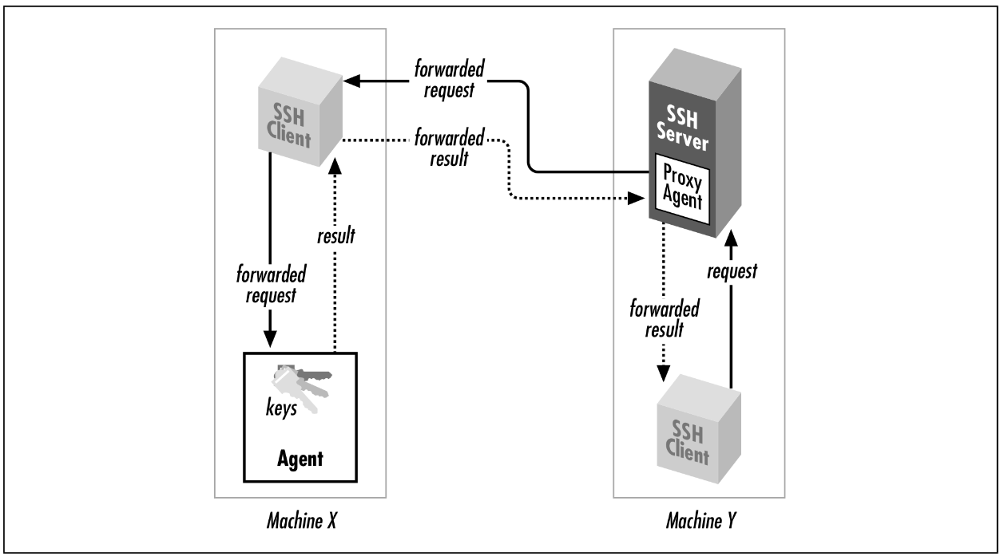

# SSH - Secure Shell

## Generate SSH Key on Client side
- Install Open SSH to generate RSA pub and pri key pair  
  ```
  sudo apt install openssh-client
  ssh -V
  ssh-keygen
  ```
- Generate Key Pairs  
    ```
    ssh-keygen -t rsa
    ```
- Hit Enter for all and go to dir  
    ```
    ~/.ssh
    ```
- Find below files
    ```bash
    id_rsa  # contains the private key.
    id_rsa.pub # contains the public key.
    ```
- See Private Key
    ```
    ----BEGIN OPENSSH PRIVATE KEY-----
    aRPhZP5/9VB7rMW8PRNoz5CjS4T9eAr1/ZBQQLGwFQavSfYVJpchUtoE6WDaM8jVMF0+qc
    VAGEBT0FCBVoHUPD26/fedMBjcOTaGHAAAAHmhpbWFuc2h1LnBhdGVsQGNsYXJpc2lnaHRzLmNvbQECAwQ=
    -----END OPENSSH PRIVATE KEY-----
    ```
- See Public Key
    ```
    ssh-rsa AAAAB3NzaC1yc2EAAAqDdXc42vWhdKZlV4SKFBnEA5McU6cFsvW1k9v0Cx/Ur+0ewTamJoHXfsCAOrEZSMUOkxuwTZsQbQw== himanshu.patel@clarisights.com
    ```
- See `known_host` file. this contains the host to which we connect, any new host will be added to this file and if any existing host facing some problem while connecting then we can remove it from this file first.
    ```
    |1|BHIFZI4UN2Oofu23naAQKttFZ3c=|R8cSNIDAP+w0nv1I2MSps39G+6Y= ssh-ed25519 AAAAC3NzaC1lZDI1NTE5AAAAIOMqqnkVzrm0SdG6UOoqKLsabgH5C9okWi0dh2l9GKJl
    |1|MbAPRd/yF/dG6nkD/ywM9xNaf3s=|o/prZJ/dAFCp5mjdOYHRRljAnC0= ecdsa-sha2-nistp256 AAAAE2VjZHNhLXNoYTItbmlzdHAyNTYAAAAIbmlzdHAyNTYAAABBBEmKSENjQEezOmxkZMy7opKgwFB9nkt5YRrYMjNuG5N87uRgg6CLrbo5wAdT/y6v0mKV0U2w0WZ2YB/++Tpockg=
    ```
- Update the public key generate into the `~/.ssh/authorized_keys` file of remote server. Now SSH remote host/server can use this public key of client to verify the client each time there is a connection request.
    ```
    root@clarisights-dev:~/.ssh# cat authorized_keys 
    ssh-rsa AAAAB3NzaC1yc2EAAAADAQABAAACAQDQ0bdaqJf9xRqDdX++PeUGkHACIJWNsMIkpWjRHwHMm/UcvYikCH/mnrO9RNnJ0K57ll64SUe6UQ3+aOXqvsaRZyQjI+xmgvPmVzc+yufsXep/c42vWhdKZlV4SKFBnEA5McU6cFsvW1k9v0Cx/Ur+0ewTamJoHXfsCAOrEZSMUOkxuwTZsQbQw== himanshu.patel@clarisights.com
    ```
    These are RSA public keys: the first number in each entry is the number of bits in the key, while the second and third are RSA-specific parameters called the public exponent and modulus. After these comes an arbitrary amount of text treated as a comment
- Update the `config` file to give an alias
    ```
    ssh root@10.193.32.55
    ```
    This can be updated to 
    ```
    ssh dev
    ```
    If we update the `config` file as
    ```
    $ cat config 
    Host dev
		HostName 10.193.32.55
		User 	root
		ForwardAgent yes    
    ```
    This will only work if we have `PermitRootLogin` and `PasswordAuthentication` as `yes` in `/etc/ssh/sshd_config` file in server we are trying to SSH into.
- In case we are connecting to a BitBucket or similar third party tool, then provide them with our public key.
    ```bash
    ssh -T git@bitbucket.org
    # if this works then SSH is successful
    ```
    Also update the `config` file as below
    ```
    Host bitbucket.org
        AddKeysToAgent yes
        IdentityFile ~/.ssh/{ssh-key-name}
    ```

## Secure Remote Command Execution
```bash
$ ssh root@10.193.32.55 'echo $HOSTNAME'
# OR
$ ssh dev 'echo $HOSTNAME'

clarisights-dev
```

## Secure File Transfer
Client to Server
```bash
$ scp dump.js dev:/root/dev/
# OR
$ scp dump.js root@10.193.32.55:/root/dev/

dump.js                 100%   66   151.3KB/s   00:00    
```
Server to Client
```bash
$ scp root@dev:/root/dev/dump.js dump.js
```
When transmitted by scp, the file is automatically encrypted as it leaves client machine and decrypted as it arrives on server machine.
To Third Host
```bash
$ scp alice@home.com:file.txt alice@:office.com:filetxt
```
## SSH Agent
An agent is a program that keeps private keys in memory and provides authentication services to SSH clients. If you preload an agent with private keys at the beginning of a login session, your SSH clients won’t prompt for passphrases. Instead, they communicate with the agent as needed.

To run the agent manually (if it do not start automatically at login)
```
$ ssh-agent $SHELL
```
Once the agent is running, it’s time to load private keys into it using the ssh-add
program. By default, ssh-add loads the key from your default identity file:

```
$ ssh-add
Need passphrase for /u/you/.ssh/identity ('Your Name <you@local.org>').
Enter passphrase: ************
Identity added: /u/you/.ssh/identity ('Your Name <you@local.org>').
```

provide the filename as an argument to ssh-add:
```
$ ssh-add my-other-key-file
```
You can also list the keys the agent currently holds:
```
$ ssh-add -l
```
delete a key from the agent:
```
$ ssh-add -d name-of-key-file
```
or delete all keys from the agent:
```
$ ssh-add -D
```

1. In advance (and only once), place special files called public key files into your
remote computer accounts. These enable your SSH clients (ssh, scp) to access
your remote accounts.
2. On your local machine, invoke the ssh-agent program, which runs in the
background.
3. Choose the key (or keys) you will need during your login session.
4. Load the keys into the agent with the ssh-add program. This requires knowledge of each key’s secret passphrase.
5. You have an ssh-agent program running on your local machine, holding your secret keys in memory. You’re now done. You have password-less access to all your remote accounts that contain your public key files.

## Port Forwarding
SSH can increase the security of other TCP/IP-based applications such as telnet, ftp, and the X Window System. A technique called `port forwarding` or `tunneling` reroutes a TCP/IP connection to pass through an SSH connection, transparently encrypting it end-to-end. Port forwarding can also pass such applications through network firewalls that otherwise prevent their use.
```
$ ssh -L 3002:localhost:119 news.yoyodyne.com
```
This says “ssh, please establish a secure connection from TCP port 3002 on my local machine to TCP port 119, the news port, on news.yoyodyne.com.”

Configure your news-reading program to connect to port 3002 on your local machine. The secure tunnel created by ssh automatically communicates with the news server on news.yoyodyne.com, and the news traffic passing through the tunnel is protected by encryption.

## Firewalls
A firewall is a hardware device or software program that prevents certain data from entering or exiting a network. For example, a firewall placed between a web site and the Internet might permit only HTTP and HTTPS traffic to reach the site. As another example, a firewall can reject all TCP/IP packets unless they originate from a designated set of network addresses.

## Known Hosts and Man-in-Middle-Attack
The first time an SSH client encounters a new remote machine, it does some extra work and prints a message like the following:
```
$ ssh -l pat shell.isp.com
Host key not found from the list of known hosts.
Are you sure you want to continue connecting (yes/no)?
```
Assuming you respond yes (the most common response), the client continues:
```
Host 'shell.isp.com' added to the list of known hosts.
```
### Man-in-Middle Attack
A hacker subverts the naming service used by your local host (file used to translate DNS names to IP's before looing into DNS) so that the name of your intended remote host, `shell.isp.com`, translates falsely to the IP address of a computer run by him! He then installs an altered SSH server on the phony remote host and waits. When you log in via your trusty SSH client, the altered SSH server records your password for the adversary’s later use.


The SSH known-host mechanism prevents such attacks. When an SSH client and server make a connection, each of them proves its identity to the other (Yes, Client and Server both).

In short, each SSH server has a secret, unique ID, called a host key, to identify itself to clients. The first time you connect to a remote host, a public counterpart of the host key gets copied and stored in your local account Each time you reconnect to that remote host, the SSH client checks the remote host’s identity using this public key. Of course, it’s better to have recorded the server’s public host key before connecting to it the first time, since otherwise you are technically open to a man-in-the-middle attack that first time.

If authentication of the server fails, various things may happen depending on the
reason for failure and the SSH configuration.
```
Host key not found from the list of known hosts.
Are you sure you want to continue connecting (yes/no)?
```
OR
```
@@@@@@@@@@@@@@@@@@@@@@@@@@@@@@@@@@@@@@@@@@@@@@@@@@@
@
WARNING: HOST IDENTIFICATION HAS CHANGED!
@
@@@@@@@@@@@@@@@@@@@@@@@@@@@@@@@@@@@@@@@@@@@@@@@@@@@
IT IS POSSIBLE THAT SOMEONE IS DOING SOMETHING NASTY!
Someone could be eavesdropping on you right now (man-in-the-middle attack)!
It is also possible that the host key has just been changed.
Please contact your system administrator.
Add correct host key in <path>/known_hosts to get rid of this message.
Agent forwarding is disabled to avoid attacks by corrupted servers.
X11 forwarding is disabled to avoid attacks by corrupted servers.
Are you sure you want to continue connecting (yes/no)
```
As the text of the message says, if you see this warning, you aren’t necessarily being hacked: for example, the remote host may have legitimately changed its host key for some reason.

## Public Keys
Before you can use public-key authentication, some setup is required:
1. You need a private key and a public key, known collectively as a key pair. You also need a secret passphrase to protect your private key.
2. You need to install your public key on an SSH server machine. 

## Agent Forwarding
In the preceding example, the remote instance of scp has no direct access to your private key, since the agent is running on the local host, not the remote. SSH provides agent forwarding to address this problem.

When agent forwarding is turned on the remote SSH server masquerades as a second ssh-agent as shown in Figure 2-4. It takes authentication requests from



```
Local Machine -> Remote Server -> Github
```
It works like this: you ask your remote server to pull some code from Github, and Github says “who are you?” to the server. Usually the server would consult its own `id_rsa` files to answer, but instead it will forward the question to your local machine. Your local machine answers the question and sends the response (which does not include your private key) to the server, which forwards it back to Github. Github doesn’t care that your local machine answered the question, it just sees that it’s been answered, and lets you connect.

### How to Enable SSH Agent Forwarding

- Add Keys to ssh-agent
    ```
    ssh-add ~/.ssh/id_rsa
    ```
- List the keys in agent and see if the key is added
    ```
    ssh-add -L
    ```
- Allow Forwarding in Your Client’s Config. Open file `~/.ssh/config` on local machine and make a new rule for remote server.
    ```
    Host example
    ForwardAgent yes
    ```
    Depending on your operating system, you may also have SSH config files at `/etc/ssh/ssh_config` for macOS or `/etc/ssh_config` for Ubuntu. These files may override the user config file at `~/.ssh/config`, so make sure nothing is conflicting.
- Test Agent forwarding from remote server.
    ```
    ssh git@github.com
    ```
